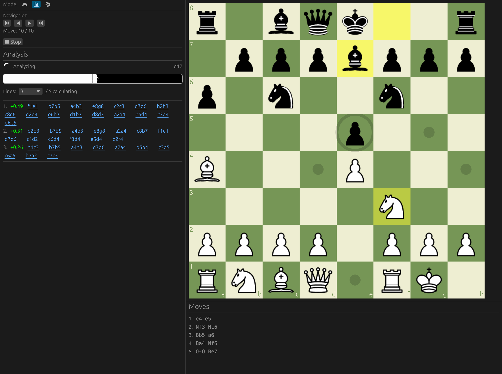

# Stockfish Chess



A desktop chess app for **macOS and Windows**: play against Stockfish at seven
strength levels, analyze positions, and build opening studies. It's built with
Rust and egui, with chess rules handled by `shakmaty`.

Stockfish itself is a separate, free chess engine that you download once. The
setup steps below cover both the app and the engine.

**Two different programs:**

| Command | What it is |
| --- | --- |
| `stockfish` | The Stockfish chess engine (no window of its own) |
| `stockfish-chess` | This desktop app, which runs the engine for you |

## Features

- Play either color against Stockfish with seven difficulty levels
- Game, multi-line analysis, and study modes
- Click-to-move or drag-and-drop, with legal move, last move, and check highlighting
- Queen, rook, bishop, and knight promotion selection
- Move history with arrow-key browsing, undo, board flipping, and persistent preferences
- Analysis lines in standard notation (`6. Re1 b5 7. Bb3`) that you can click to play
- Four board themes: Classic, Lichess, Chess.com, and Dark
- Study chapters, comments, variations, JSON persistence, and PGN export
- User-visible engine startup and runtime errors

## Setup on macOS

1. **Install Rust** (1.88 or newer):

   ```bash
   curl --proto '=https' --tlsv1.2 -sSf https://sh.rustup.rs | sh
   ```

2. **Install Stockfish** with [Homebrew](https://brew.sh):

   ```bash
   brew install stockfish
   ```

   The app finds Homebrew's Stockfish automatically.

   Without Homebrew, download `stockfish-macos-universal.tar.gz` from the
   [Stockfish downloads page](https://stockfishchess.org/download/) or
   [GitHub releases](https://github.com/official-stockfish/Stockfish/releases),
   extract it, and move the file whose name starts with `stockfish` into
   `~/bin`. macOS blocks downloaded programs until you allow them:

   ```bash
   chmod +x ~/bin/stockfish*
   xattr -d com.apple.quarantine ~/bin/stockfish*
   ```

3. **Build and install the app**, then run it:

   ```bash
   git clone https://github.com/Divhanthelion/stockfish-chess.git
   cd stockfish-chess
   cargo install --path . --locked
   stockfish-chess
   ```

## Setup on Windows

1. **Install Rust**: download and run `rustup-init.exe` from
   [rustup.rs](https://rustup.rs). When it offers to install the Visual Studio
   C++ Build Tools, accept; Rust needs them on Windows. Open a new PowerShell
   window afterwards.

2. **Build and install the app** in PowerShell:

   ```powershell
   git clone https://github.com/Divhanthelion/stockfish-chess.git
   cd stockfish-chess
   cargo install --path . --locked
   ```

   This puts `stockfish-chess.exe` in `%USERPROFILE%\.cargo\bin`, which the
   Rust installer added to your `PATH`.

3. **Get Stockfish**: download `stockfish-windows-x86-64-universal.zip` from the
   [Stockfish downloads page](https://stockfishchess.org/download/) or
   [GitHub releases](https://github.com/official-stockfish/Stockfish/releases)
   (use `stockfish-windows-arm64-universal.zip` on an ARM PC). Extract it. The
   engine is the `.exe` inside its `stockfish` folder. Copy **just that `.exe`**
   next to the app; the folder's other files aren't needed. If you used
   Explorer's **Extract All** in your Downloads folder, this does it:

   ```powershell
   Copy-Item "$HOME\Downloads\stockfish-windows-x86-64-universal\stockfish\stockfish-windows-x86-64-universal.exe" "$HOME\.cargo\bin\"
   ```

   No renaming is needed.

4. **Run it**:

   ```powershell
   stockfish-chess
   ```

## Linux

Linux works too and is tested in CI. Install Rust with the macOS command above,
install Stockfish from your package manager (`sudo apt install stockfish` or
`sudo dnf install stockfish`), then build as on macOS. Building needs the GTK,
xkbcommon, Wayland, and X11 development packages.

## Where the app looks for Stockfish

The app checks these places in order and uses the first Stockfish it finds:

1. The file in the `STOCKFISH_PATH` environment variable
2. Next to the `stockfish-chess` application
3. The current working directory
4. `~/bin`
5. On macOS and Linux: `/opt/homebrew/bin`, `/usr/local/bin`, `/usr/bin`
6. Any directory on your `PATH`

Official file names such as `stockfish-macos-universal` or
`stockfish-windows-x86-64-universal.exe` are recognized without renaming. On
Windows the engine must be the `.exe` file.

To use a Stockfish stored somewhere else:

```bash
STOCKFISH_PATH="/path/to/stockfish" stockfish-chess
```

```powershell
$env:STOCKFISH_PATH = "C:\path\to\stockfish-windows-x86-64-universal.exe"; stockfish-chess
```

If the app can't find or start Stockfish, the sidebar shows the full error and
a setup hint.

## Running from Source

To run without installing, from the repository:

```bash
cargo run --release --locked
```

Debug builds (`cargo run --locked`) compile faster but play noticeably slower.
Use `--locked` so dependencies match `Cargo.lock`.

Enable logs when troubleshooting:

```bash
RUST_LOG=info cargo run --locked
```

```powershell
$env:RUST_LOG = "info"; cargo run --locked
```

## Playing

1. Choose White or Black under **Play as**. The board turns so your pieces are
   at the bottom.
2. Click a piece to show its legal destinations, then click a destination, or
   drag the piece there.
3. When a pawn reaches the back rank, choose its promotion piece.
4. Stockfish responds automatically on its turn.

**Undo** takes back your last move and Stockfish's reply, and stays available
after the game ends so you can retry a lost position. Use ←/→ (or Home/End) to
browse earlier positions.

Draw offers are evaluated at full strength from Stockfish's perspective.
Stockfish accepts when it does not evaluate its own advantage above 0.50 pawns,
and the sidebar tells you whether it accepted.

Switching to Analysis or Study keeps your game; switch back to Game to resume
it.

## Modes

- **Game** — play against Stockfish, adjust difficulty, resign, offer a draw,
  undo moves, and export completed games.
- **Analysis** — run continuous five-line, full-strength Stockfish analysis and
  play moves from principal variations.
- **Study** — organize positions into chapters and variations, add comments,
  save studies locally, and export PGN.

## Difficulty Levels

- Novice (~1100)
- Beginner (~1350)
- Casual (~1500)
- Intermediate (~1800)
- Advanced (~2100)
- Expert (~2500)
- Maximum Strength

## Architecture

```text
src/
├── main.rs              Application entry point
├── app.rs               State, modes, engine coordination, and dialogs
├── assets/pieces/       Embedded SVG chess pieces
├── engine/
│   ├── actor.rs         Background UCI process actor
│   ├── discovery.rs     Cross-platform Stockfish discovery
│   └── difficulty.rs    Strength presets
├── game/
│   ├── mod.rs
│   └── state.rs         Rules, history, outcomes, FEN, SAN, and UCI
├── study/
│   └── mod.rs           Study tree and persistence
└── ui/
    ├── analysis.rs      Evaluation bar and principal variations
    ├── board.rs         Board rendering and interaction
    ├── controls.rs      Game controls
    ├── move_list.rs     Move history
    ├── pieces.rs        Embedded SVG rendering
    ├── study_panel.rs   Study controls
    └── theme.rs         Board themes
```

The egui thread sends commands over an `mpsc` channel to a dedicated engine
thread. That thread owns the Stockfish child process and communicates through
UCI over stdin/stdout. The UI remains responsive while Stockfish searches.

## Development

```bash
cargo fmt --check
cargo clippy --all-targets --locked -- -D warnings
cargo test --locked
```

Tests cover game state, undo, promotion choices, UCI command construction and
parsing, difficulty options, engine discovery, board hit-testing, analysis
notation, score orientation, draw acceptance, and engine timeouts.

One test plays a short game against a real Stockfish and is skipped by default.
With Stockfish on `PATH` or in `STOCKFISH_PATH`:

```bash
cargo test --locked -- --ignored
```

## Troubleshooting

### Stockfish unavailable

- macOS: prefer `brew install stockfish`, then confirm `which stockfish`.
- Windows: copy the `.exe` itself next to `stockfish-chess.exe`, not the
  extracted folder; `Get-Command stockfish*` lists it if it's on `PATH`.
- Confirm `STOCKFISH_PATH` points to a file, not a directory.
- Confirm the binary is executable and matches your machine architecture.
- Read the detailed startup error in the sidebar or run with `RUST_LOG=info`.

### `stockfish` opens a text prompt instead of the GUI

That is the engine. Run the app with `stockfish-chess`.

### Pieces do not render

Ensure all SVG files are present under `src/assets/pieces/`.

### Slow debug performance

Use `cargo run --release --locked`; release builds enable LTO.

## Roadmap

- PGN import
- Opening-book support
- Time controls
- Online multiplayer
- Move sounds

## License

MIT. See [LICENSE](LICENSE).

## Acknowledgments

- [Stockfish](https://stockfishchess.org/)
- [shakmaty](https://github.com/niklasf/shakmaty)
- [egui](https://github.com/emilk/egui)
- Piece SVGs derived from [lichess-org/lila](https://github.com/lichess-org/lila)
  (CC0)
